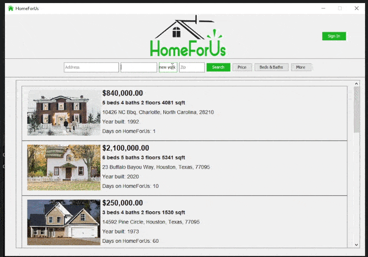
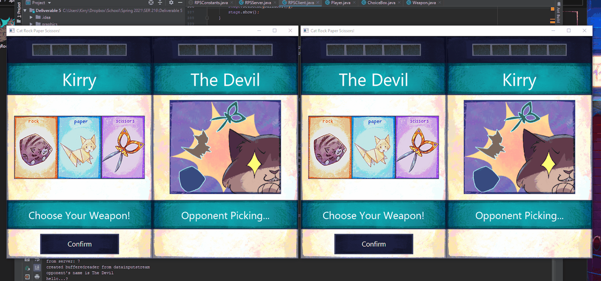

Skills: Python / Java / Unity / C# / C / Art / Animation / Design / Photoshop / After Effects

- ⚒️ I’m currently working on earning my software engineering degree at ASU and getting an internship for Summer 2022 
- 🤓 I’m currently learning Pytorch / Machine Learning (**any help with this is appreciated!**) / AWS 
- 💌 How to reach me: racheljcorey@gmail.com 
- 🕵️‍♀️ Pronouns: she/her 

        

  

  

### Portfolio

#### Here are a couple projects from the past few years:

### AI-House

**Personal Project**

**Tools used:**
*Python, Pytorch, C#, Unity, Google Colab*

*Coming soon....*

### HomeForUs

**Group Project for Databases class**

[Github Repo](https://github.com/javallej/Homeforus) 

[Demo Video](https://www.youtube.com/watch?v=vEO3KilV9o4)

**Tools used:**
*Java, Java Swing, MySQL*

**My share of work in the group:**

*Program architecture: 98%*

*UX design: 90%*

*GUI coding: 80%*

*Database design: 20%*

*SQL queries: 10%*

**Description:**

This is a program my group created in SER322, Fall 2021. I was fortunate enough to have an awesome group with great hard-working members. We made a program that can connect to a local MySQL database that we all designed as a group together. 

The program meant to represent an application where prospective home buyers can search a real estate database and apply to purchase a house. It supports database account creation for either a user or realtor type, wherein the two different users have different permissions and abilities within the system, such as realtor users being able to post a new listing for a house in the database, or approve submitted applications from home buyers.

I was responsible for most of the programs' architecture, UX design, and GUI coding, as well as leading the GUI coding development within the last 2 weeks of the course. 

### Checkers

**Project for Software Quality class**

**Tools used:**
*Java, JavaFX, Photoshop*

**Description:**

This is a small checkers game I made for one of my school assignments. I created all of the graphics and wrote all of the code. It is a standard checkers game program, and allows for multi-jumping opponents' pieces. You can either play locally with another person, or against a primative AI. 

*Unfortunately, I am not permitted to post the code I wrote online for this assignment, as my professor has told me it would be an academic integrity violation; hopefully the example in the picture above gives you a good enough idea about what it's like.*

### Networked Tic-Tac-Toe

**Project for Software Quality class**

**Tools used:**
*Java, JavaFX, Photoshop*

**Description:**

This is a small tic-tac-toe game I made for one of my school assignments. I created all of the graphics and wrote all of the code. It is a standard tic-tac-toe game program, where you can connect to another client of the program on a local network and play together with someone else.

*Unfortunately, I am not permitted to post the code I wrote online for this assignment, as my professor has told me it would be an academic integrity violation; hopefully the example in the picture above gives you a good enough idea about what it's like.*
