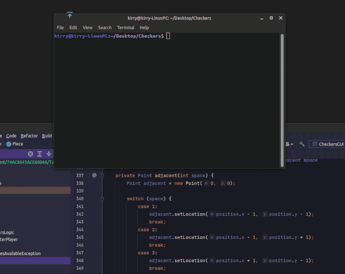

# co tam! / hello!

  

 <b>Skills:</b> <i>Python / Java / Unity / C# / C / Art / Animation / Design / Photoshop / After Effects</i> 

- ⚒️ I’m currently working on earning my software engineering degree at ASU, set to graduate in Spring 2023
- 🤞 I'm also working on getting an internship for Summer 2022 
- 🤓 I’m currently learning Pytorch / Machine Learning (**any help with this is appreciated!**) / AWS 
- 💌 How to reach me: racheljcorey@gmail.com 
- 🕵️‍♀️ Pronouns: she/her 

     
    
    

  

  

# 💻 Portfolio 🖌️
#### Here are a couple projects from this past year....

## 🤖 ***AI-House*** 🏠

**Personal Project: WIP**

**Tools used:**
*Python, Pytorch, Huggingface Transformers, C#, Unity, Google Colab*

*Coming soon....*

## 🏘️ ***HomeForUs*** 🔎

**Group Project for Databases class: completed October 2021**

  

[Github Repo](https://github.com/javallej/Homeforus) and [Demo Video](https://www.youtube.com/watch?v=vEO3KilV9o4)

**Tools used:**
*Java, Java Swing, MySQL*

**My share of work in the group:**

*Program architecture: 98%*

*UX design: 90%*

*GUI coding: 80%*

*Database design: 20%*

*SQL queries: 10%*

**Description:**

This is a program my group created in SER322, Fall 2021. I was fortunate enough to have an awesome group with great hard-working members. We made a program that can connect to a local MySQL database that we all designed as a group together. 

The program meant to represent an application where prospective home buyers can search a real estate database and apply to purchase a house. It supports database account creation for either a user or realtor type, wherein the two different users have different permissions and abilities within the system, such as realtor users being able to post a new listing for a house in the database, or approve submitted applications from home buyers.

I was responsible for most of the programs' architecture, UX design, and GUI coding, as well as leading the GUI coding development within the last 2 weeks of the course. 

## ♟️ ***Checkers*** 🎲

**Project for Software Quality class: completed May 2021**

  

**Tools used:**
*Java, JavaFX, Photoshop*

**Description:**

This is a small checkers game I made for one of my school assignments. I created all of the graphics and wrote all of the code. It is a standard checkers game program, and allows for multi-jumping opponents' pieces. You can either play locally with another person, or against a primative AI. You can also play with the text console version instead of the GUI, and have the option to watch two AI players play against each other.

*Unfortunately, I am not permitted to post the code I wrote online for this assignment, as my professor has told me it would be an academic integrity violation; hopefully the example in the picture above gives you a good enough idea about what it's like.*

## ❌ ***Networked Tic-Tac-Toe*** ⭕

**Project for Software Quality class: completed April 2021**

  

**Tools used:**
*Java, JavaFX, Photoshop*

**Description:**

This is a small tic-tac-toe game I made for one of my school assignments. I created all of the graphics and wrote all of the code. It is a standard tic-tac-toe game program, where you can connect to another client of the program on a local network and play together with someone else.

*Unfortunately, I am not permitted to post the code I wrote online for this assignment, as my professor has told me it would be an academic integrity violation; hopefully the example in the picture above gives you a good enough idea about what it's like.*
