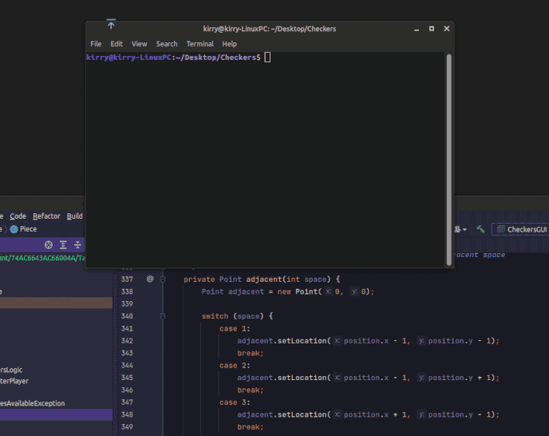

# hello ',:)

  

 <b>Skills:</b> <i>Python / Java / Javascript / Unity / C# / C / Art </i> 

- ⚒️ currently working on my software engineering degree at ASU, set to graduate in spring 2023
- 🤓 currently learning good ol Javascript 
- 💌 how to reach me: racheljcorey : g.mail 

     
    

  

#### 💻 a couple of my school projects:

## 🏘️ ***HomeForUs*** 🔎

**group project for databases class: completed October 2021**

  

[Github Repo](https://github.com/javallej/Homeforus) and [Demo Video](https://www.youtube.com/watch?v=vEO3KilV9o4)

**tools used:**
*Java, Java Swing, MySQL*

**description:**

This is a program my group created in SER322, Fall 2021. I was fortunate enough to have an awesome group with great hard-working members. We made a program that can connect to a local MySQL database that we all designed as a group together. I was responsible for most of the programs' architecture, UX design, and GUI coding. 

The program is a real estate service, where prospective home buyers can search a real estate database and apply to purchase a house. It supports database account creation for either a user or realtor type, wherein the two different users have different permissions and abilities within the system, such as realtor users being able to post a new listing for a house in the database, or approve submitted applications from home buyers.

## ♟️ ***Checkers*** 🎲

**project for software quality class: completed May 2021**

  

**tools used:**
*Java, JavaFX, Photoshop*

**description:**

This is a small checkers game I made for one of my school assignments. I created all of the graphics and wrote all of the code. It is a standard checkers game program, and allows for multi-jumping opponents' pieces. You can either play locally with another person, or against a primative AI. You can also play with the text console version instead of the GUI, and have the option to watch two AI players play against each other.

*Unfortunately, I am not permitted to post the code I wrote online for this assignment, as my professor has told me it would be an academic integrity violation; hopefully the example in the picture above gives you a good enough idea about what it's like.*

## ❌ ***Networked Tic-Tac-Toe*** ⭕

**project for software quality class: completed April 2021**

  

**tools used:**
*Java, JavaFX, Photoshop*

**description:**

This is a small tic-tac-toe game I made for one of my school assignments. I created all of the graphics and wrote all of the code. It is a standard tic-tac-toe game program, where you can connect to another client of the program on a local network and play together with someone else.

*Unfortunately, I am not permitted to post the code I wrote online for this assignment, as my professor has told me it would be an academic integrity violation; hopefully the example in the picture above gives you a good enough idea about what it's like.*
